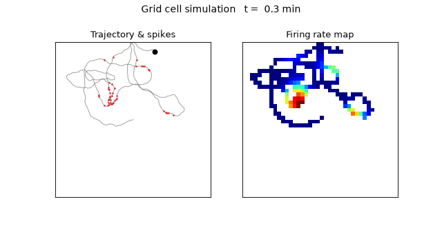
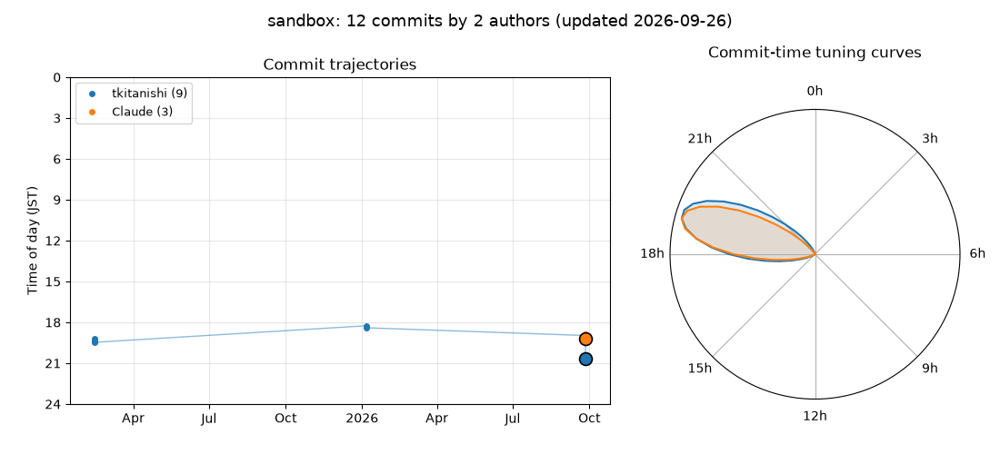

# Sandbox

研究室メンバーで共有している MATLAB の砂場リポジトリです。気軽に試し書きしてください。

## グリッド細胞シミュレーション

<p align="center">
  
</p>

仮想ラットが 1 m × 1 m の箱の中をランダムに走り回ります。左は直近20秒の軌跡（灰）とスパイク（赤）、右は発火率マップです。時間とともに六角格子が浮かび上がってきます。

MATLAB で `gridcell_demo.m` を実行すると同じアニメーションが見られます。冒頭のパラメータを変えて遊んでみてください。

| パラメータ | 意味 | 既定値 |
| --- | --- | --- |
| `SPACING` | グリッド間隔 [m] | 0.35 |
| `ORIENT` | 格子の向き [deg] | 8 |
| `PHASE` | 格子の位置ずれ [m] | [0.12 0.07] |
| `T_TOTAL` | シミュレーション時間 [s] | 900 |
| `SAVE_GIF` | `true` で GIF を保存 | false |

発火率は、60度ずつ向きの異なる3つの平面波の和で与えています（Solstad et al., 2006, *Hippocampus* 16:1026–1031）。上の GIF は同じモデルの Python 版 `tools/make_gridcell_gif.py` で作りました。

## コミットの軌跡

<p align="center">
  
</p>

このリポジトリのコミット履歴を、ラットの軌跡のように描いています。左は横軸が日付、縦軸がコミットした時刻（JST）で、メンバーごとにコミットを時間順につないでいます。大きい点が最新のコミットです。右は、コミットした時刻の分布を頭方位細胞のチューニングカーブ風に描いたもので、夜型か朝型かが分かります。

main に push されるたびに GitHub Actions が描き直します（bot のコミットは除外）。同じ人が複数の名前やメールアドレスでコミットしている場合は、[`.mailmap`](.mailmap) に1行足すと1人にまとまります。

## 今日の認知地図豆知識

<!-- TRIVIA:START -->
> **2026-10-09** の一言（10/37）
>
> 走行速度に比例して発火率が変わる速度細胞が内側嗅内皮質で見つかった。
>
> — *Kropff et al. (2015) Nature 523:419-424*
<!-- TRIVIA:END -->

GitHub Actions が毎朝6時過ぎ（JST）にこの欄を書き換えます。ネタは [`trivia/facts.json`](trivia/facts.json) に入っていて、1日1件ずつ順番に表示されます。お気に入りの論文や小ネタがあれば、次の形式で追加してください。

```json
{"text": "一言の説明", "ref": "著者 (年) 雑誌 巻:ページ"}
```
